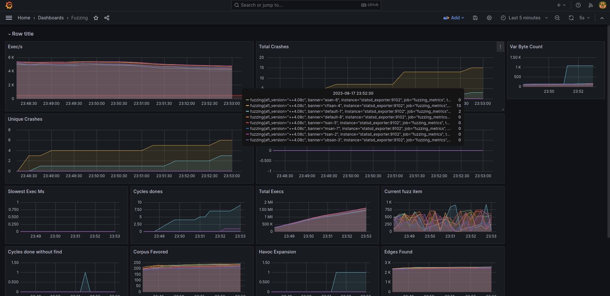
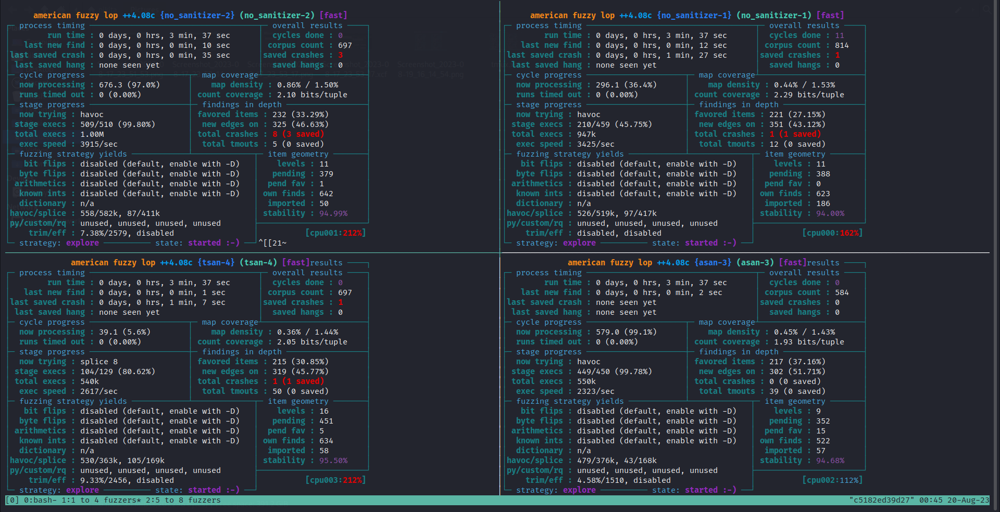

# Автоматическое распараллеливание фаззинга, удаленный мониторинг и визуализация метрик
Репозиторий представляет собой несколько docker сервисов, которые настроены для фаззинга.
- Утилита`afl-tmux`. Запускает несколько экземпляров одной цели параллельно в сессии `tmux`, которые указаны в yaml файле и строит графики в `Grafana`
на основе метрик `Prometheus`.
- Утилита `afl-pause`. Останавливает все запущенные экземпляры фаззера
- Утилита `afl-resume`. Возобновляет остановленные экземпляры
- `Grafana` строит графики по запущенными процессам
- `Prometheus` собирает метрики для `Grafana`
- `StatSD Exporter` собирает метрики с `AFL`
- `Node Exporter` собирает метрики с сервера

```bash
afl-tmux targets.yaml -i
```

`afl-tmux` удобно использовать для одной цели, если она собрана с несколькими санитайзерами.
Запускает каждый экземпляр с санитайзером в одном потоке и на оставшихся ядрах
можно запустить сборку без санитайзеров (Пример конфигурационного файла ниже).

- Grafana: localhost:3000
- Prometheus: localhost:9090



## Установка
Отредактируйте docker-compose.yml. Укажите папку с целью для фаззинга в сервисе afl. 
(по-умолчанию `/opt/workspace`)

```
docker-compose up -d
```

### Подключите Prometheus к Grafana:

Перейдите в Grafana (http://localhost:3000) с кредами `admin:admin`, установите новый пароль.
Вкладка Sidebar -> Administration -> Data Source -> Add new -> Prometheus. В поле prometheus server URL укажите адрес
из сети Docker (http://prometheus:9090) -> Save and test.

### Загрузите шаблоны графиков в Grafana:
Sidebar -> Dashboards -> New -> Import. Загрузите json из grafana-dashboards.

## Запуск
`afl-tmux` вместе с `afl-pause` и `afl-resume` доступны глобально,
```
$ docker exec -it afl bash
[AFL++ hash]# afl-tmux -y comfig.yml -i
[AFL++ hash]# tmux attach -t 0
```

Для просмотра запущенных фазеров выберите окно tmux (`Ctrl-q + w`, комбинацию tmux можно изменить в Docker-afl/tmux.conf).



По адресу http://localhost:3000/d/sRI6PCfGz/fuzzing?orgId=1&refresh=5s доступны графики.

## Настройка
Пример настройки yaml файла для фаззинга функций интерпретатора PHP. 
Для каждой сборки с санитайзером запускается лишь один экземпляр (запускать более одного экземпляра нет смысла).

```yaml
targets:
  no_sanitizer:
    path: '/src/php-no-san/sapi/cli/php'
    threads: 20
  asan:
    path: '/src/php-asan/sapi/cli/php'
    threads: 1
  tsan:
    path: '/src/php-tsan/sapi/cli/php'
    threads: 1
  msan:
    path: '/src/php-msan/sapi/cli/php'
    threads: 1
  ubsan:
    path: '/src/php-ubsan/sapi/cli/php'
    threads: 1
  cfisan:
    path: '/src/php-cfisan/sapi/cli/php'
    threads: 1
  lsan:
    path: '/src/php-lsan/sapi/cli/php'
    threads: 1

fuzzer_settings:
  afl_environment:
    - AFL_STATSD=1
    - AFL_STATSD_TAGS_FLAVOR=dogstatsd
    - AFL_STATSD_HOST=statsd_exporter
    - AFL_STATSD_PORT=9125
  input_dir: in
  output_dir: out
  arguments: "-r \"unserialize(file_get_contents('php://stdin'));\""
```

